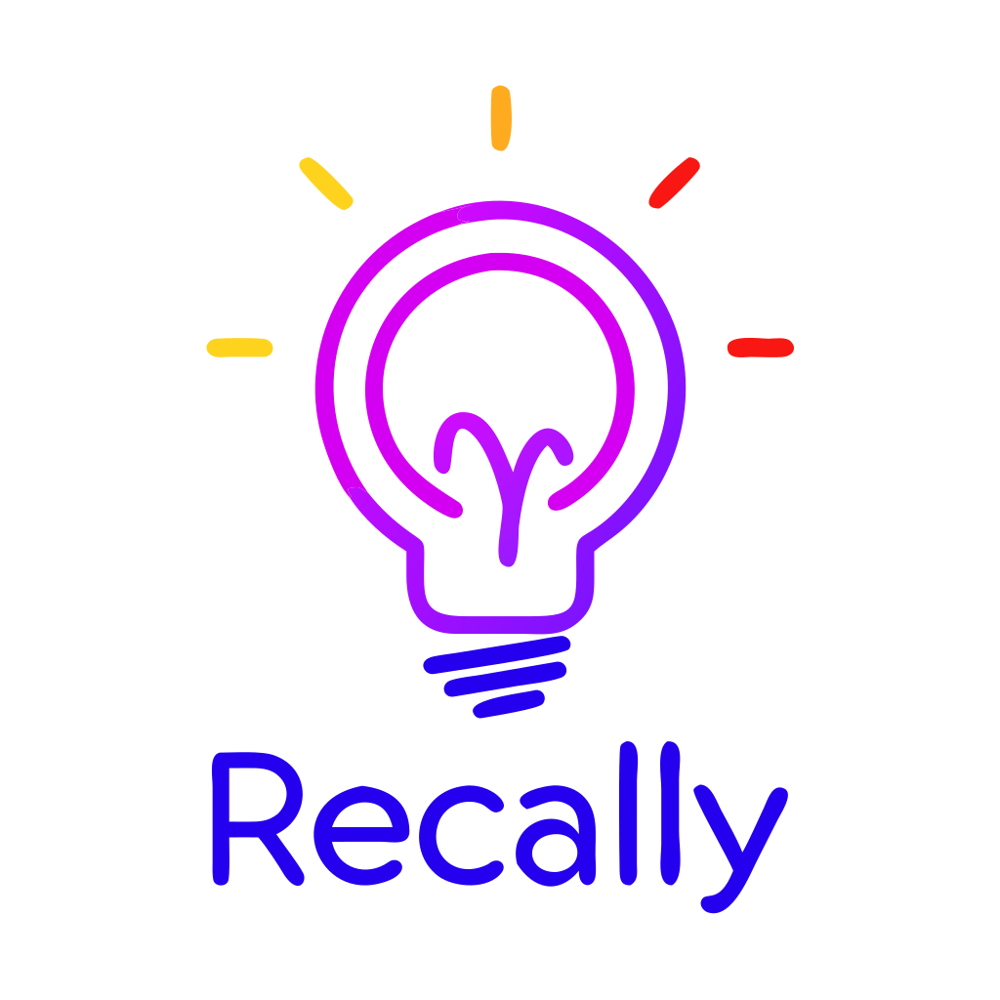

# Recally

[Recally.io](https://recally.io) is your personal knowledge engine, designed to help you collect, organize, and remember the digital content that matters most. Save articles, videos, and podcasts with a single click, and let Recally’s smart tools help you recall and connect ideas when you need them. Say goodbye to information overload and hello to effortless learning.



## 🚀 Key Features

- **Smart Content Capture**: Save articles, videos, and podcasts with a single click
- **Flexible Content Fetching**: 
  - Multiple fetcher support for various content sources
  - Raw HTTP client for simple pages
  - [Jina reader](https://github.com/jina-ai/reader) for advanced text extraction
  - Headless browser for JavaScript-heavy sites
  - [Crawl4AI](https://github.com/unclecode/crawl4ai) (Coming) for AI-powered content extraction
- **AI-Powered Organization**:
  - Automatic tagging and categorization
  - Semantic search capabilities
- **Privacy & Control**:
  - Privacy-first architecture
  - First class self-hosting support
  - No tracking or data sharing

## 🛠 Installation

```bash

# Clone the repository
git clone https://github.com/vaayne/vibrain

# Change directory
cd vibrain

# edit the .env file as needed
cp env.example .env
# vim .env

# Run the application
docker compose up -d

# Access the application
open http://localhost:1323
```

## 🏗 Tech Stack

### Backend
- **API Server**: [Echo](https://github.com/labstack/echo) - High performance, minimalist Go web framework
- **Job Queue**: [River](https://github.com/riverqueue/river) - Background job processing
- **Database**: 
  - [PostgreSQL](https://www.postgresql.org/) - Primary data store
  - [PgVector](https://github.com/pgvector/pgvector) - Vector similarity search
- **Tools**:
  - [Migrate](https://github.com/golang-migrate/migrate) - Database migrations
  - [Sqlc](https://github.com/sqlc-dev/sqlc) - Type-safe SQL

### Frontend
- **Framework**: [React](https://github.com/facebook/react) - UI development
- **Build Tool**: [Vite](https://github.com/vitejs/vite) - Next generation frontend tooling
- **Styling**: 
  - [TailwindCSS](https://github.com/tailwindlabs/tailwindcss) - Utility-first CSS
  - [shadcn/ui](https://github.com/shadcn-ui/ui) - Accessible components

### AI Integration
- [OpenAI](https://openai.com/) and compatible models for:
  - Content analysis
  - Tag generation
  - Semantic search

## 🤝 Contributing

We welcome contributions!

## 📝 License

See the [LICENSE](LICENSE) file for details.

- **Non-commercial Use**: Free under MIT License terms
- **Commercial Use**: Contact [license@recally.io](mailto:license@recally.io) for permission

